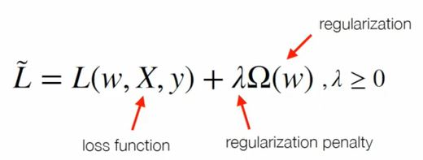

# Deeplearning Loadmap

- 일반적으로 대학원에서 학습하는 부분
    1. 머신러닝
    2. 데이터 처리 
    3. 관련 분야 (Domain Knowledge)

- 필요 능력, 기술
    1. 프로그래밍
    2. 수학 / 통계
    3. 데이터 처리
    4. 필드지식

- 입문 단계 학습 범위
    1. 방법론의 컨셉 이해
    2. Tool별 장단점
    3. 차이점 비교

- 심화 과정 학습
    1. 미적분 : 미적분, 벡터연산, 급수 ...
    2. **선형대수 : 행령연산, 벡터연산 (연산이 중요)**
    3. 확률 / 통계 : 베이지안, 분포 (분포의 특징과 관계 중요)
    `* 추가로 도움이 되는 과목 : 해석학, 수치해석`

- **딥러닝 학습자가 알아야 할 10가지**
    1. **지도학습(Supervised learning) vs 비지도학습(Unsupervised learning)**
        - 지도학습 : 문제와 정답 이용, 문제 풀고 답 맞춰보면서 오답을 줄이는 학습 방법
        - 비지도학습 : 답을 알려주지 않음, 문제만 알려주고 특성을 스스로 찾게 만들어서 예측
    2. **Regression(회귀) vs Classification**
        - Regression, Classification, Ranking, Clustering ... 여러 문제가 존재하지만 Regression, Classification을 흔히 볼 수 있음
        - 우리가 예측하고자 하는 값의 형태가 무엇인가?
            - target value가 continuous하면 Regression
                - ex. 온도, 집값 
            - target value가 discrete하면 Classification
                - ex. 성별, 대출유무, 신용등급
    3. **Numerical data vs Categorical data**
        - 필요에 따라 혼용해서 사용 가능
        - Numerical data : 정량적 측정에 의한 데이터
            - ex. 키, 학생수, 점수
        - Categorical data : 그룹화 되어 있는 데이터
            - ex. 성별, 티켓공급, 혈액형
    4. **Labeling vs One-hot encoding**
        - categorical data를 숫자로 표현하는 방법
        - Labeling : 각 그룹마다 고유 번호 부여
            - ex. 호랑이 : 0, 고양이 : 1, 개 : 2
            - 많아지면 숫자 크기 자체가 결과에 영향을 줄 수 있다
        - One-hot encoding : Vector화 해서 차원을 늘리고 0과 1로만 표현
            - ex. 호랑이 : [1,0,0], 고양이 : [0,1,0], 개 : [0,0,1]
    5. **Sigmoid function vs Softmax function**
        - Sigmoid function : 0부터 1까지로 표현할 수 있음
            - 인공신경망 내 출력층에 sigmoid를 적용하면 항상 0과 1 사이의 결과 나옴
            - 이진 분류에서 많이 사용
            - 다중 분류에서도 사용가능하기는 함
        - Softmax function 
            - 다중 분류 해결하기 위해 나옴
            - 마지막 output에서 모든 합이 1이 되도록 조정 > 그 값을 확률처럼 사용 가능
            - Sigmoid처럼 큰 확률 두개는 못 뽑음
    6. **Mean Squared Error vs Cross Entropy Loss**
        - Mean Squared Error : 회귀 문제에서 주로 사용
        - Cross Entropy Loss : 분류 문제에서 주로 사용
        - 목적에 따라 손실함수를 정해야함 (손실함수는 최적화의 근원)
    7. **Gradient descent vs Stochastic gradient descent**
        - 두 개의 방법론은 같음 (업데이트 수식은 같지만 데이터 사용 방법 차이)
        - Gradient descent : 최적화에 가장 널리 사용
            - 미분을 통해 Loss가 최소가 되게 하는 변수를 구하는게 목적
            - 큰 Data를 한 번에 계산하는 것은 부담이 있음
        - Stochastic gradient descent : 한 번 업데이트 시 일부 데이터만 활용
            - 일부데이터 >> 랜덤 미니 배치 >> Stochastic
    8. **Training error is 2 and Validation error is 10**
        - over fitting : 학습 데이터에 맞춰 변수 업데이트가 되어 새로운 데이터에 대해 예측을 잘 못하는 현상
            - Training data 엄청 잘 맞추지만 새로운 데이터 예측 못 함
        - training error, validation error, test error를 보면서 모델을 fine 튜닝함
    9. **L(&Theta;) = loss + regularization(규제) term**
        - over fitting 해결법, loss에 제약 조건 주는 방법, 제약 조건 종류는 사용자가 결정 가능
        - 
    10. **My Model achieves 90% test accuracy**
        - ex. class 1 : 99%, class 2 : 72%, class 3 : 99%, total : 90%
            - 다 맞춰야하는 task라면 class 2 때문에 좋지 않다
        - loss, accuracy, precision, recall, AUC 말고 다양한 평가 기준이 존재 (잘 따져보고 사용해야한다)
        - 좋은 모델이라는 것이 성능 말고 공정성 측면을 이야기 할 수도 있음 >> 그렇다면 다른 이야기가 됨
        - performance도 중요하지만 검증 척도 중요
              

