# Lecture0

- 머신러닝을 이용해서 의사결정을 내리면 `슈퍼파워`를 갖는 것 (Andrew Ng)
- Linear regression, Logistic regression 2가지 기본적인 알고리즘 교육 예정
- Neural networks, Convolutional Neural Network, Recurrent Neural Network >> DeepLearning
- Reference 
    - Andrew Ng's ML class
        - https://class.coursera.org/ml-003/lecture
        - http://www.holehouse.org/mlclass/ (note)
    - Convolutional Neural Networks for Visual Recognition
        - http://cs23ln.github.io/
    - Tensorflow
        - https://www.tensorflow.org
        - https://github.com/aymericdamien/TensorFlow-Examples
- Schedule
    - Machine Learning basic concepts
    - Linear regression
    - Logistic regression (classification)
    - Multivariable (Vector) linear/logistic regression
    - Neural networks
    - Deep Learning
        - CNN
        - RNN
        - Bidirectional Neural networks
# Lecture1
### Machine Learning Basics

- What is ML?
    - Limitations of explicit programming
        - such as Spam filter, Automatic driving (they have to many rules)
    - ML : "Field of study that gives computers the abilty to learn without being explicitly programmed" Arthur Samuel (1959)
- Supervised/Unsupervised Learing
    - Supervised learning : learning with labeled examples - training set
        - Most common problem type in ML
        - training data set 이용 출력 구하기
        - Predicting final exam score(0~100) based on time spent
            - regression (점수 범위가 넓기 때문)
        - Pass/non-pass based on time spent
            - binary classification (둘 중 하나이기 때문)
        - Letter grade (A,B,C,E and F) based on time spent
            - multi-label classification (여러 개 존재하기 때문)
    - Unsupervised learning : un-labeled data
# Lecture2
### Linear Regression

- Regression model을 학습 한다는 것은 하나의 가설을 적을 필요가 있음
    - (Linear) Hypothesis : 세상에 있는 많은 데이터가 생각보다 선형적인 경우가 많음
        - 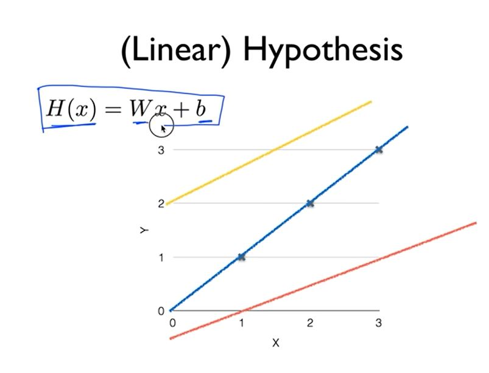
        - 위와 같이 가성을 세움
    - Cost(=Loss) function 
        - 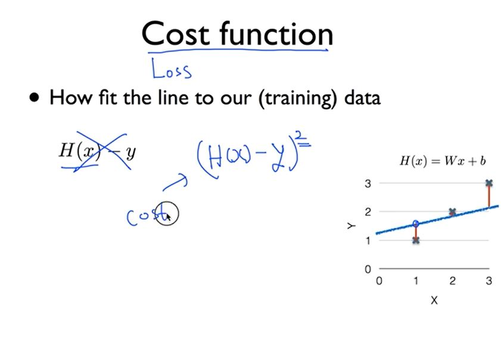
        - 위와 같이 제곱을 하는 이유
            1. 양수로 크기 비교 가능
            2. 작은 값 더 작게, 큰 값 더 크게 
        - Goal : to Minimize cost    
            - 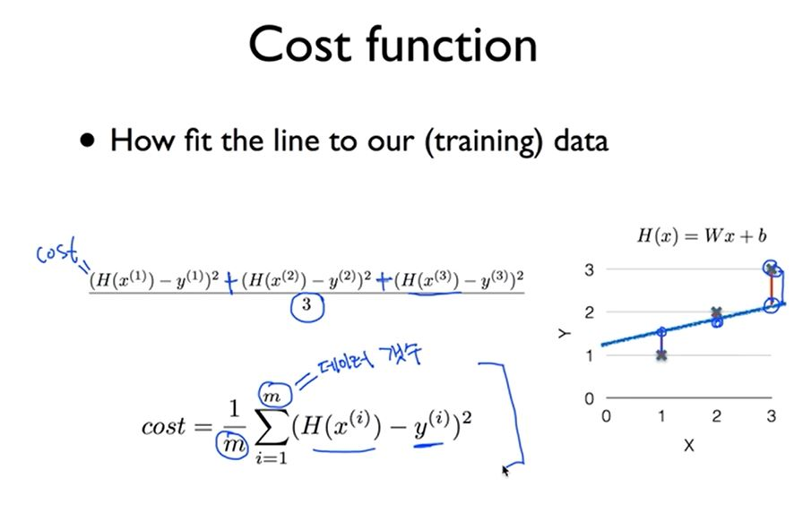
            - 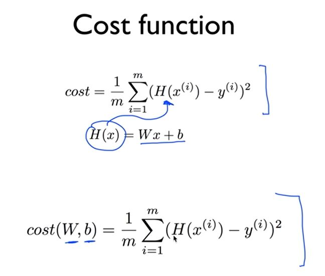
            - 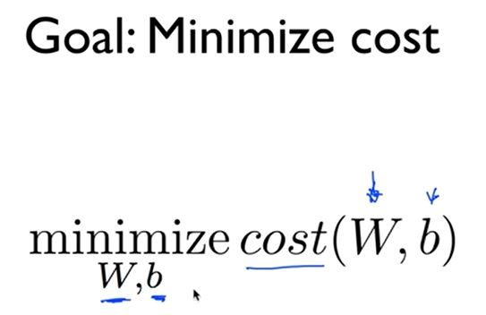
            - cost를 최소로 만든 W,b 찾는 것이 목표

# Lecture3
### How to minimize cost

- W : Wegith (가중치)
- b : bias (절편)
- Simplified hypothesis
    - H(x) = Wx + b
- 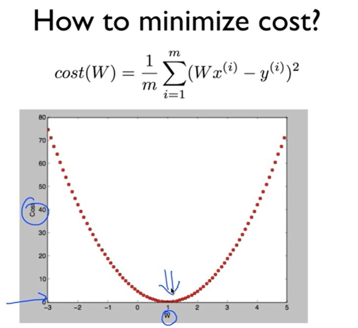
- Gradient descent algorithm (경사 하강 알고리즘)
    - Minimize cost function
    - Gradient descent is used many minimization problems (머신러닝 이외에도 사용)
    - cost를 작게 하는 W,b 찾을 수 있음
    - 여러 w를 찾을 수 있을 때도 사용 가능
        - It can be applied to more general function
        - ex. cost(w1, w2,....)
    - 미분을 이용하여 최솟 값 구함
    - 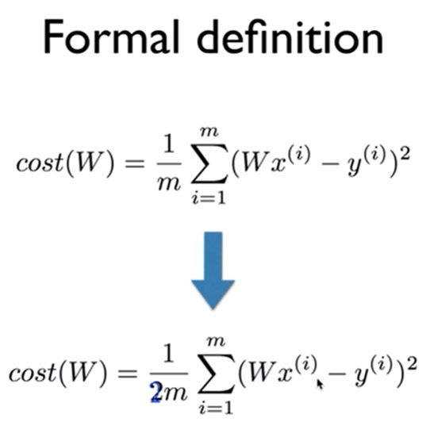
    - 계산의 편의를 위해 2m으로 나눔
    - 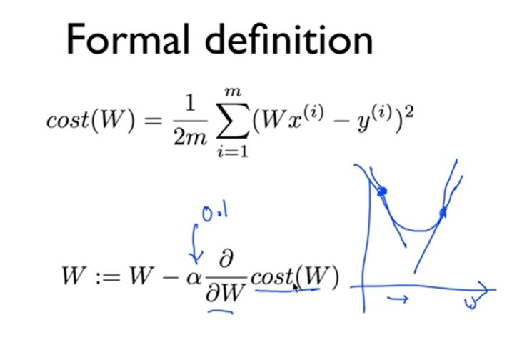
    - w를 큰 값으로 이동하겠다는 뜻 (&alpha; : learning rate)
    - 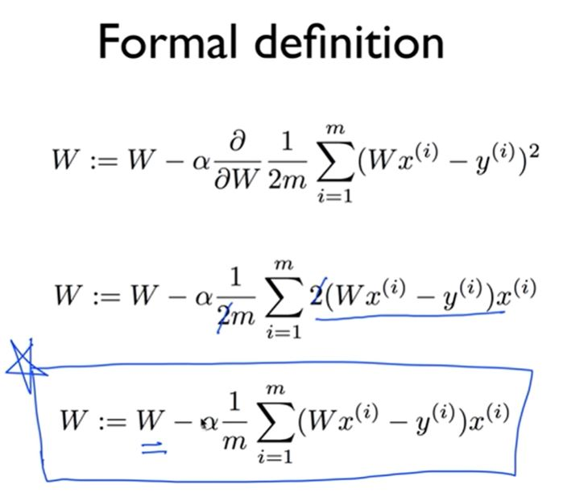
    - 최종 모델
    - 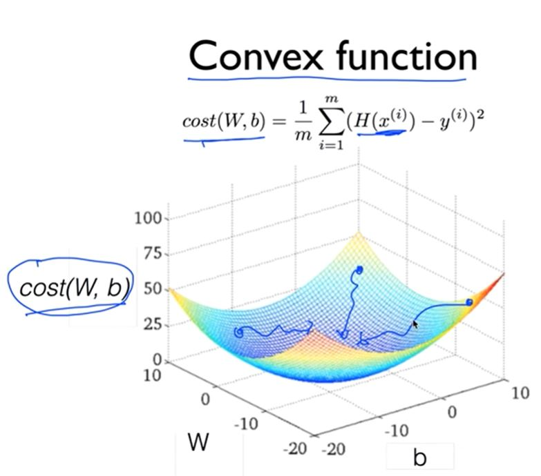
    - Convex function을 보면 어디에서나 하나의 위치로 향하는 것을 확일 할 수 있음

# Lecture4
### Multivariable linear regression

- Recap : 요약
- Linear regression을 설계하기 위한 필요사항
    - Hypothesis : 가설이 무엇인지 (ex. H(x)=...)
    - Cost function : cost 혹은 loss 어떻게 정의할 것인가(잘 했는지 못 했는지를 코스트로 판단, ex. 제곱해서 사용)
    - Gradient descent algorithm : cost를 최적화하는 알고리즘 (함수의 경사면을 따라 내려간다)
- regression using three inputs (x1, x2, x3)
    - 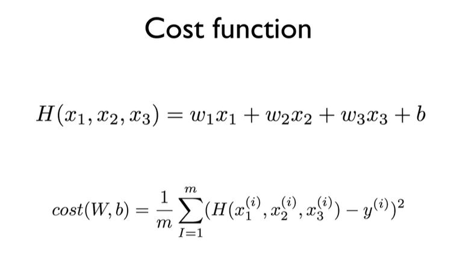
    - Matrix를 이용해 표현 (Dot Product)
    - Hypothesis using matrix
        - &omega;1x1 + &omega;2x2 + &omega;3x3 + ... + &omega;nxn = WX
        - H(X) = XW
        - X의 한 행을 Instance라고 칭한다
        - W 구하기
            - 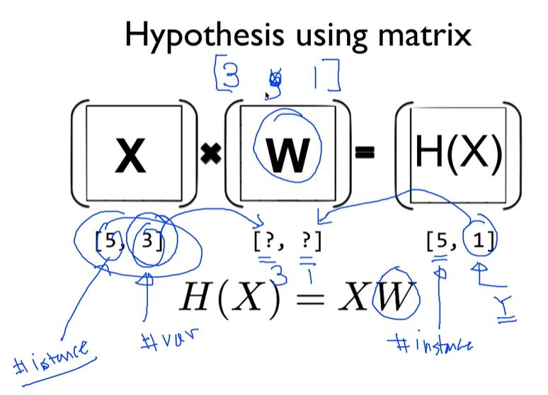
    - Matrix를 사용하면 input, instance, output이 많아도 한 번에 처리 가능
    - Lecture (theory) : H(X) = Wx + b
    - Implementation (TensorFlow) : H(X) = XW (행령 X가 먼저)

